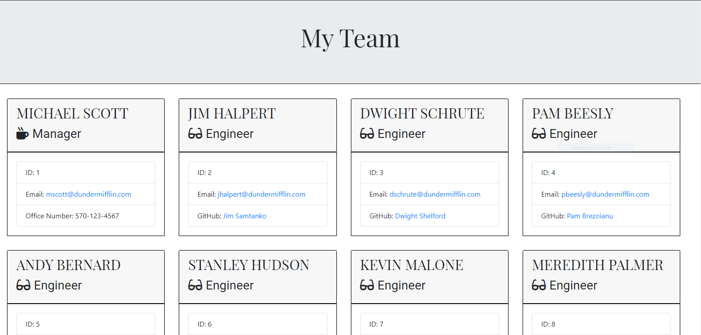
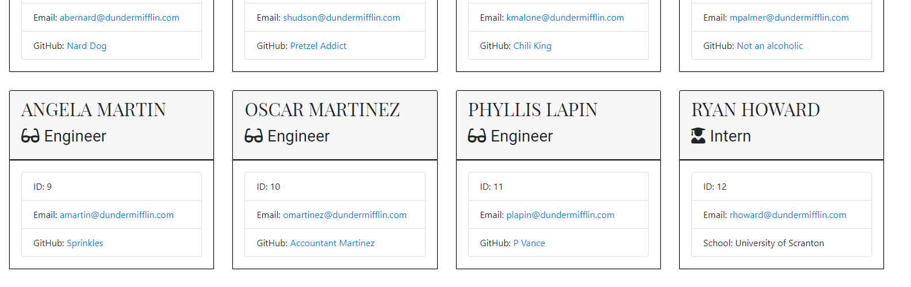

# Template Engine - Employee Summary

A Node CLI (command line application) that takes in information about employees and generates an HTML webpage that displays summaries for each person (software engineering team generator). The application will prompt the user for information about the team manager and then information about the team members. The user can input any number of team members, and they may be a mix of engineers and interns. This CLI also passes all unit tests. 

When the user has completed building the team, the application will create an HTML file that displays a nicely formatted team roster based on the information provided by the user. 


## Deployment

Deployed Website:





## Built With

* HTML
* CSS
* Node.js


## Installation 

* `npm install`
* `npm install inquirer`
* `npm install fs`


## Usage

* The generator begins with prompting questions about the manager, with a series of questions being answered about id, email, and office number.
* After completing the manager information, you are prompted with whether you want to get a summary on engineers or interns. After making a selection, it will run through series of questions pertaining to the team member.
* Intern information will be prompted by series of questions such as id, email, and school.
* Once the prompts finish, you will be given an alert that states, "Employee Summary Complete".


## Tests

The dependencies are, [jest](https://jestjs.io/) for running the provided tests, and [inquirer](https://www.npmjs.com/package/inquirer) for collecting input from the user.

There are also unit tests to help you build the classes necessary.

It is recommended that you follow this workflow:

1. Run tests
2. Create or update classes to pass a single test case
3. Repeat

🎗 Remember, you can run the tests at any time with `npm run test`

It is recommended that you start with a directory structure that looks like this:

```
lib/           // classes and helper code
output/        // rendered output
templates/     // HTML template(s)
test/          // jest tests
  Employee.test.js
  Engineer.test.js
  Intern.test.js
  Manager.test.js
app.js         // Runs the application
```


## Authors

  - **Jennifer Rosa**
    [Rosajen27](https://rosajen27.github.io/)


## License


This project is licensed under the MIT License.

Copyright (c) 2020 Jennifer Rosa

Permission is hereby granted, free of charge, to any person obtaining a copy
of this software and associated documentation files (the "Software"), to deal
in the Software without restriction, including without limitation the rights
to use, copy, modify, merge, publish, distribute, sublicense, and/or sell
copies of the Software, and to permit persons to whom the Software is
furnished to do so, subject to the following conditions:

The above copyright notice and this permission notice shall be included in all
copies or substantial portions of the Software.

THE SOFTWARE IS PROVIDED "AS IS", WITHOUT WARRANTY OF ANY KIND, EXPRESS OR
IMPLIED, INCLUDING BUT NOT LIMITED TO THE WARRANTIES OF MERCHANTABILITY,
FITNESS FOR A PARTICULAR PURPOSE AND NONINFRINGEMENT. IN NO EVENT SHALL THE
AUTHORS OR COPYRIGHT HOLDERS BE LIABLE FOR ANY CLAIM, DAMAGES OR OTHER
LIABILITY, WHETHER IN AN ACTION OF CONTRACT, TORT OR OTHERWISE, ARISING FROM,
OUT OF OR IN CONNECTION WITH THE SOFTWARE OR THE USE OR OTHER DEALINGS IN THE
SOFTWARE.


## Acknowledgements

* Trilogy Education Services

